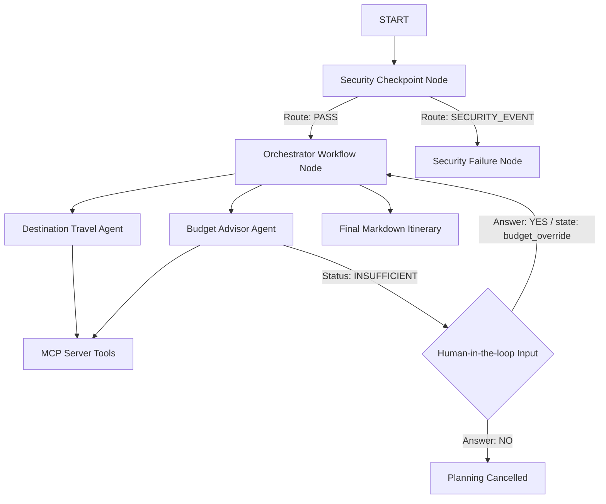

# Submission Write-Up: trip-planner

## Problem Statement
Planning travel can be complex, involving multiple variables such as flight estimations, budgeting constraints, safety indices, exchange rates, and tourist attraction reviews. Handling all these facets requires specialized knowledge sources. `trip-planner` coordinates these tasks automatically using specialized AI agents, and does so securely and transparently.

---

## Solution Architecture

---

## Concepts Used

1. **ADK Workflow:** Implemented as a state graph (`root_agent` inside [agent.py](file:///c:/Users/DD-ADMIN/Documents/adk-workspace/trip-planner/app/agent.py)) routing requests through security and the orchestrator.
2. **LlmAgents:** 
   - `destination_agent` (destination travel expert)
   - `budget_agent` (financial advisor)
3. **MCP Server:** Local stdio MCP server in [mcp_server.py](file:///c:/Users/DD-ADMIN/Documents/adk-workspace/trip-planner/app/mcp_server.py) providing 4 custom tools.
4. **Security Checkpoint:** Dedicated node `security_checkpoint` to scrub PII and block injection keywords before inputs hit the LLMs.
5. **RequestInput (HITL):** Prompts the user when a budget is insufficient and waits for explicit approval before building the itinerary.
6. **State Sharing:** Utilizes `ctx.state` to carry values like `trip_details` and `budget_override` across node executions.

---

## Security Design

- **PII Scrubbing:** Automatically redacts emails and phone numbers from user requests.
- **Prompt Injection Guard:** Searches for critical bypass strings (e.g., "ignore previous instructions").
- **Domain filter:** Restricts itineraries to hazardous or active war zones.
- **Audit Logging:** Emits structured JSON events with severity (INFO/WARNING/CRITICAL) for monitoring safety decisions.

---

## MCP Server Design

Exposes 4 high-value domain-specific tools:
1. `get_attraction_reviews`: Fetches ratings and reviews for local attractions.
2. `get_exchange_rate`: Gets current exchange rates to USD.
3. `get_flight_estimate`: Provides flight cost estimates.
4. `get_safety_index`: Provides safety and advisory levels.

---

## HITL Flow
When the Budget Advisor determines estimated costs exceed the user's budget, the orchestrator triggers a `RequestInput` block. This interrupts execution and asks the user: *"Do you still want to proceed? (yes / no)"*. Replying "yes" stores a `budget_override` in context state and allows planning to resume; replying "no" cancels the task cleanly.

---

## Impact / Value Statement
`trip-planner` minimizes planning friction by aggregating budget validation, flight estimation, safety reports, and itineraries into a single secure automated flow, ensuring users never overspend or travel underprepared.
